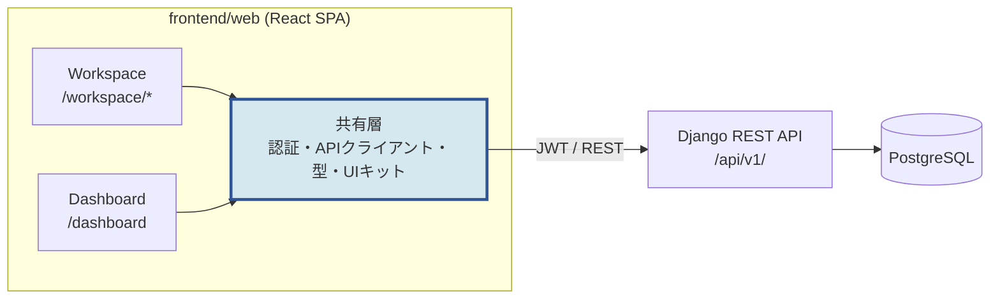
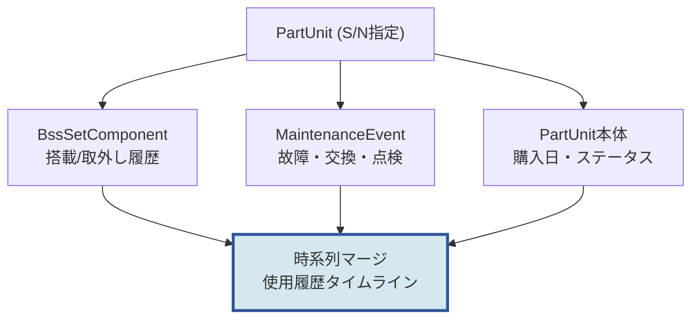

---
# ===== 表紙メタ（aibod-docx の COVER_INFO に対応） =====
client_name:    "株式会社AIBOD"
system_name:    "BOMOps"
system_subname: "Dynamic BOM Platform"
document_type:  "フロントエンド実装計画書"
subtitle:       "DOC-FE-001"
version:        "Ver 0.1"
issue_date:     "発行日: 2026年6月10日"

# ===== 管理メタ（md一次ソースの運用用。docx には出ない） =====
doc_id:         "DOC-FE-001"
status:         "draft"
owner:          "Hisato"
last_updated:   "2026-06-10"
related_docs:
  - "CLAUDE.md ドメインモデル（正準スキーマ）"
  - "docs/erchart.mmd L4 BAITENサービス管理 ER図"
changelog:
  - "2026-06-11 v0.2 P1〜P6実装完了を反映（全フェーズDoD達成）"
  - "2026-06-10 v0.1 初版作成"
---

## 1. 目的とスコープ

### 1.1 目的

BOMOps バックエンド（Django + DRF, `/api/v1/`）に対するWebフロントエンドを
`frontend/web/` 配下に構築する。提供する機能領域は次の2つ。

| 領域 | 役割 | 主な利用者 |
|------|------|-----------|
| **Workspace** | レコードの新規作成・編集・検索、部品の使用履歴参照 | 組立・設置・保守の実務担当 |
| **Dashboard** | 全体サマリー（総数・状態別集計）の閲覧 | 管理者・経営層 |

### 1.2 スコープ外（v1では作らない）

- モバイル専用UI（レスポンシブ対応はするがネイティブアプリは対象外）
- 権限ロール管理（v1は認証ユーザー全員が同権限。ロール分離はバックエンド拡張後）
- Notion からのデータ移行ツール（別タスク）
- リアルタイム更新（WebSocket）。v1はポーリング/手動リフレッシュで十分

## 2. アーキテクチャ方針

### 2.1 単一SPA + 2エリア構成（推奨）

Workspace と Dashboard は **1つのSPAの中の2つのトップレベルエリア** として実装する。
別アプリに分割しない。

**理由（aibod-design-philosophy 準拠）:**

- 認証・APIクライアント・型定義・デザイントークンを共有でき、二重管理を避けられる
- Dashboard は実質「集計の読み取り画面」であり、独立アプリにするほどの規模がない
- デプロイ・CORS・ビルドパイプラインが1本で済む
- 将来分割が必要になっても、ルート単位 (`/workspace/*`, `/dashboard`) で
  切り出せる構造にしておけば移行コストは小さい



*図 2.1-1: 全体構成*

### 2.2 技術スタック

| 領域 | 採用 | 理由 |
|------|------|------|
| FW | **React 18 + TypeScript + Vite** | AIBOD標準。型安全・高速HMR |
| ルーティング | React Router v6 | デファクト |
| サーバ状態 | TanStack Query v5 | キャッシュ・再取得・ページネーションの定番 |
| HTTP | axios | JWTリフレッシュのinterceptor実装が容易 |
| フォーム | react-hook-form + zod | バリデーションをZodスキーマに集約 |
| API型 | **openapi-typescript で自動生成** | DRF spectacular の `/api/v1/schema/` から生成。手書き型を持たない |
| スタイル | CSS Modules + AIBODデザイントークン（CSS変数） | 依存を増やさない。ネイビーインディゴ×スカイブルー準拠 |
| グラフ | Recharts | Dashboard の集計表示。軽量で十分 |
| テスト | Vitest + React Testing Library | Vite ネイティブ |

> 💡 補足：UIコンポーネントライブラリ（MUI等）は v1 では導入しない。
> 画面数が限られており、AIBODブランド準拠のデザイントークン＋自前の
> 小さなUIキット（Button / Input / Select / Table / Modal / Badge）で足りる。
> `html-webapp-design` スキルのデザインシステムを移植する。

### 2.3 ディレクトリ構成

```
frontend/web/
├── package.json / vite.config.ts / tsconfig.json
├── .env.example              # VITE_API_BASE_URL
├── src/
│   ├── main.tsx / App.tsx    # ルーティング・プロバイダ
│   ├── api/
│   │   ├── client.ts         # axios + JWT interceptor
│   │   ├── schema.d.ts       # openapi-typescript 自動生成（編集禁止）
│   │   └── hooks/            # useParts, useSets... (TanStack Query)
│   ├── auth/                 # ログイン画面・トークン管理・ガード
│   ├── components/           # 共有UIキット（Button, Table, Badge...）
│   ├── features/
│   │   ├── workspace/
│   │   │   ├── parts/        # 部品マスタ・部品実物
│   │   │   ├── sets/         # BSSセット・構成部品・設定
│   │   │   ├── customers/    # 顧客・拠点・拠点設定
│   │   │   ├── events/       # 保守・導入イベント（追記型）
│   │   │   └── search/       # 横断検索・シリアル逆引き・使用履歴
│   │   └── dashboard/        # サマリーカード・チャート
│   └── styles/               # tokens.css（AIBODブランド変数）
└── tests/
```

## 3. Workspace 機能設計

### 3.1 画面一覧

| # | 画面 | パス | 機能 |
|---|------|------|------|
| W-1 | ログイン | `/login` | JWT取得（`/auth/token/`）・リフレッシュ自動化 |
| W-2 | 部品マスタ一覧/編集 | `/workspace/part-masters` | 一覧・フィルタ・新規・編集・無効化 |
| W-3 | 部品実物一覧/編集 | `/workspace/part-units` | S/N検索・ステータス管理・購入情報 |
| W-4 | 製品モデル/BOM | `/workspace/product-models` | モデルCRUD・BOM構成表の編集 |
| W-5 | 顧客・拠点 | `/workspace/customers` | 顧客CRUD・拠点CRUD・ライフサイクル状態 |
| W-6 | 拠点設定 | `/workspace/sites/:id/config` | SiteConfig編集（secret系はマスク表示・上書きのみ） |
| W-7 | BSSセット | `/workspace/sets` | セットCRUD・構成部品の搭載/取外し・セット設定 |
| W-8 | イベント記録 | `/workspace/sets/:id/events` | 保守/導入イベントの追記・タイムライン表示 |
| W-9 | 横断検索 | `/workspace/search` | シリアル逆引き＋各リソース横断検索 |
| W-10 | 部品使用履歴 | `/workspace/part-units/:id/history` | 指定部品の搭載履歴＋保守履歴タイムライン |

### 3.2 共通UXパターン

- **一覧画面**: サーバサイドページネーション（DRF `page` 準拠）、フィルタは
  クエリパラメータと同期（URL共有可能）、列ソート
- **作成/編集**: 右側スライドオーバー（ドロワー）でフォーム表示。
  一覧のコンテキストを失わない。zodスキーマでクライアント検証後POST/PATCH
- **追記型リソース**（保守/導入イベント）: 編集・削除UIを出さない。
  「追記」ボタンのみ。タイムライン表示で履歴性を視覚化
- **secret系フィールド**（SiteConfig）: 値は `****xxxx` 表示。
  「新しい値を設定」操作でのみ上書き入力欄を開く（現値の取得・表示はしない）
- **削除**: 参照保護（`on_delete=PROTECT`）のエラーは「使用中のため削除不可」
  として人間可読に変換

### 3.3 部品使用履歴（W-10）の設計

「指定した部品（S/N）がいつ・どのセットで・何があったか」を1本のタイムラインで返す。



*図 3.3-1: 使用履歴タイムラインのデータ合成*

フロントで3つのAPIを呼んでマージするのではなく、**バックエンドに専用エンドポイントを追加**する
（§5.1）。N+1呼び出しの回避と、将来のCSVエクスポート再利用のため。

## 4. Dashboard 機能設計

### 4.1 表示内容（v1）

| ブロック | 内容 | ソース |
|---------|------|--------|
| KPIカード | セット総数 / 稼働中セット数 / 部品実物総数 / 在庫部品数 | summary API |
| セット状態 | ステータス別件数（組立完了/設置済/修理中/回収済/廃棄） | summary API |
| 部品状態 | ステータス別件数（在庫/割当済/故障/廃棄）＋カテゴリ別内訳 | summary API |
| 拠点状況 | ライフサイクル別拠点数（準備中/稼働中/撤退済/拠点/貸出中） | summary API |
| 直近の動き | 直近の保守・導入イベント10件 | events API（既存） |

- 集計は **バックエンドの単一サマリーAPI**（§5.2）で1リクエスト取得。
  フロントで全件取得して数えない（ページネーション越しの集計は不正確になるため）
- 自動更新は60秒間隔の再取得（TanStack Query `refetchInterval`）

## 5. バックエンド追加開発（本計画に含む）

フロントだけでは成立しない2つのAPIを追加する。いずれも既存モデルの読み取りのみ。

### 5.1 部品使用履歴API

```
GET /api/v1/part-units/{id}/history/
```

レスポンス（イベント種別の混在タイムライン、時系列降順）:

```json
{
  "part_unit": {"id": 1, "serial_number": "CAM-0002", "part_code": "CAM-456"},
  "timeline": [
    {"kind": "MAINTENANCE", "event_type": "REPLACEMENT", "occurred_at": "...", "set_code": "BST-2025-0001", "note": "..."},
    {"kind": "UNMOUNTED",   "occurred_at": "...", "set_code": "BST-2025-0001", "role": "CAMERA1"},
    {"kind": "MOUNTED",     "occurred_at": "...", "set_code": "BST-2025-0001", "role": "CAMERA1"},
    {"kind": "PURCHASED",   "occurred_at": "...", "purchase_order_no": "PO-001"}
  ]
}
```

### 5.2 ダッシュボードサマリーAPI

```
GET /api/v1/dashboard/summary/
```

`BssSet` / `PartUnit` / `CustomerSite` / `Customer` の `values().annotate(Count)` 集計を
1レスポンスに集約。件数のみ（個人情報・secret なし）。

### 5.3 CORS / 環境

- `CORS_ALLOWED_ORIGINS` に Vite dev サーバ（`http://localhost:5173`）を追加
- `docker-compose.yml` に `web-frontend` サービス追加は **任意**（v1はローカル
  `npm run dev` で開発し、デプロイ形態確定後にコンテナ化）

## 6. 実装フェーズ計画

| Phase | 内容 | 完了条件（DoD） |
|-------|------|----------------|
| **P1 基盤** | Vite雛形・デザイントークン・axios+JWT（リフレッシュ込み）・openapi-typescript型生成・ログイン画面・ルーティング骨格 | ログインして空のWorkspace/Dashboardに遷移できる |
| **P2 Workspace読み取り** | 一覧画面（W-2,3,4,5,7）＋フィルタ・ページネーション・詳細表示 | 全リソースが閲覧・検索できる |
| **P3 Workspace書き込み** | 作成/編集フォーム・構成部品の搭載/取外し・SiteConfigマスクUX・イベント追記（W-6,8） | 新規レコード作成〜編集の業務フロー一巡 |
| **P4 検索・履歴** | バックエンド履歴API（§5.1）・シリアル逆引き・使用履歴タイムライン（W-9,10） | S/N入力→現在地と履歴が3秒以内に出る |
| **P5 Dashboard** | バックエンドサマリーAPI（§5.2）・KPIカード・チャート | 集計がDB実数と一致（テストで検証） |
| **P6 仕上げ** | エラー/ローディング統一・ネットワーク断対応（network-resilienceスキル準拠の接続状態表示）・Vitestユニットテスト・README | `npm run build` が警告ゼロ、主要フローのテストあり |

依存順は P1→P2→P3 が直列。P4 と P5 はそれぞれのバックエンドAPI実装後に並行可能。

### 6.1 規模感の目安

| Phase | 新規ファイル数の目安 | 備考 |
|-------|------------------|------|
| P1 | 15〜20 | 雛形含む |
| P2〜P3 | 30〜40 | リソース毎に list/form/hooks |
| P4〜P5 | 10〜15 | バックエンド2API含む |
| P6 | 5〜10 | テスト・ドキュメント |

## 7. リスクと対応

| リスク | 対応 |
|--------|------|
| Node.js 実行環境が未確認 | P1着手前に `node >= 20` を確認。未導入なら導入手順をREADMEに明記 |
| DRFスキーマとフロント型の乖離 | openapi-typescript 生成を `npm run codegen` に固定し、CIで差分検知（将来） |
| secret値のフロント露出 | SiteConfig は read でマスク済（実装済）。フロントは現値取得をそもそも行わない設計 |
| 追記型の原則をUIが破る | イベント系は編集/削除UIを実装しない。API側も405で二重防御（実装済） |
| 画面数の肥大化 | リソースCRUDは共通の List/Form 抽象に寄せ、画面固有コードを最小化 |

## 8. 決定事項と保留事項

### 8.1 決定（本計画の前提）

- 単一SPA・2エリア構成（§2.1）
- API型は OpenAPI スキーマから自動生成し手書きしない
- 集計・履歴合成はバックエンド責務（フロントで件数を数えない）

### 8.2 保留（実装着手後に判断）

- デプロイ形態（S3+CloudFront か、Django静的配信に同居か）→ AWS構成確定後
- 認証ユーザー管理画面（v1はDjango adminで運用）
- Dashboard の期間指定集計（月次推移など）→ v2候補
