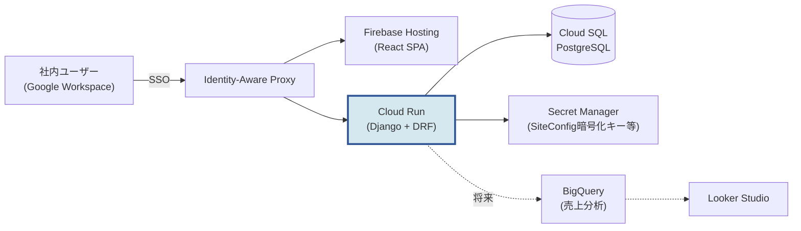

---
# ===== 表紙メタ（aibod-docx の COVER_INFO に対応） =====
client_name:    "株式会社AIBOD"
system_name:    "AIBOD Retail Systems"
system_subname: "BOMOps / BAITEN STAND"
document_type:  "クラウド選定検討書"
subtitle:       "DOC-IF-001"
version:        "Ver 0.1"
issue_date:     "発行日: 2026年6月11日"

# ===== 管理メタ（md一次ソースの運用用。docx には出ない） =====
doc_id:         "DOC-IF-001"
status:         "draft"
owner:          "Hisato"
last_updated:   "2026-06-11"
related_docs:
  - "DOC-FE-001 フロントエンド実装計画書"
  - "CLAUDE.md ドメインモデル（正準スキーマ）"
changelog:
  - "2026-06-11 v0.1 初版作成（GCP vs AWS 比較・推奨）"
---

## 1. 目的とスコープ

AIBOD のリテール事業系システム（**BOMOps**＝BAITEN STAND の部品・組立・設置管理、
および今後の BAITEN STAND クラウド連携・売上分析等）のクラウド基盤として、
**GCP を採用する方針の妥当性**を AWS と比較して検討する。

### 1.1 前提（ワークロードの特性）

| 項目 | 内容 |
|------|------|
| 第一ユースケース | BOMOps（Django + DRF + PostgreSQL / React SPA、社内向け） |
| トラフィック | 社内数名〜十数名。低頻度・断続的（夜間ほぼゼロ） |
| 今後の拡張 | BAITEN STAND 端末連携（売上同期・テレメトリ）、売上分析BI、AI画像認識パイプライン |
| 外部連携 | Loyverse / Square / PayPay / Slack / Google（いずれもSaaS REST APIでクラウド非依存） |
| 社内既存資産 | fieldup-backend が **AWS**（ECS Fargate + ALB + CloudFront + RDS + SES）で稼働中 |
| 社内ツール | Google Workspace（Gmail / Drive / Calendar）を全社利用 |

## 2. 比較サマリー

| 観点 | GCP | AWS | 優位 |
|------|-----|-----|------|
| 小規模アプリの実行コスト | Cloud Run（ゼロスケール・リクエスト課金） | Fargate + ALB（常時課金、ALB固定費） | **GCP** |
| 社内ツールの認証 | IAP + Google Workspace アカウントでSSO | Cognito等を別途構築 | **GCP** |
| 売上分析・BI | BigQuery + Looker Studio（無料BI） | Redshift/Athena + QuickSight（有料） | **GCP** |
| AI/ML（画像認識） | Vertex AI、Vision系の蓄積 | SageMaker | **GCP**（僅差） |
| IoTデバイス管理 | **IoT Core 廃止済**（自前/サードパーティ） | AWS IoT Core 健在 | **AWS** |
| メール送信 | ネイティブサービスなし（SendGrid等併用） | SES（安価・実績あり） | **AWS** |
| 社内の運用知見 | これから蓄積 | fieldup で蓄積済（デプロイ・監視・障害対応） | **AWS** |
| 請求・管理の一元化 | 2クラウド併用になる | 既存と統合 | **AWS** |
| 東京/大阪リージョン | 両方あり | 両方あり | 同等 |

## 3. GCP を推す根拠（詳細）

### 3.1 コスト構造が「社内向け低トラフィック」に合う

Cloud Run はリクエスト処理中のみ課金され、ゼロまでスケールする。BOMOps のような
夜間・休日にトラフィックがないシステムではアイドル費用が発生しない。
一方 AWS の標準構成（Fargate + ALB）は、タスクの常時稼働分に加えて
**ALB の固定費（月額約20ドル〜）が床値**になる。

**BOMOps 月額試算（東京リージョン・概算）:**

| 構成要素 | GCP | AWS |
|---------|-----|-----|
| アプリ実行 | Cloud Run: 0〜500円（ゼロスケール） | Fargate 0.25vCPU常時: 約1,500円 |
| ロードバランサ | 不要（Cloud RunがHTTPS終端） | ALB: 約3,000円 |
| DB | Cloud SQL (db-g1-small): 約3,500円 | RDS (t4g.micro): 約2,500円 |
| SPA配信 | Firebase Hosting: ほぼ0円 | S3 + CloudFront: ほぼ0円 |
| **合計目安** | **約4,000〜5,000円/月** | **約7,000〜8,000円/月** |

> 💡 補足：金額は2026年時点の目安。確定時は各社の料金計算ツールで再見積りすること。
> AWS側も App Runner や Lambda 構成にすれば差は縮まるが、社内の既存パターン
> （ECS Fargate + ALB）から外れるため運用知見の優位が薄れる。

### 3.2 社内向けツールの認証が簡単（IAP × Google Workspace）

AIBOD は Google Workspace を全社利用している。GCP の Identity-Aware Proxy (IAP) を
使えば、**Googleアカウントによる SSO を BOMOps の前段に置ける**（アプリ側の改修最小）。
退職者のアクセス遮断も Workspace のアカウント停止に連動する。
AWS で同等を実現するには Cognito + SAML/OIDC 連携の構築が必要で手数が多い。

### 3.3 リテール分析の将来像に直結（BigQuery + Looker Studio）

BAITEN STAND の売上・在庫データ分析は、BigQuery（毎月1TiBスキャン無料、以降$6.25/TiB）+
Looker Studio（基本無料）で**ほぼ追加費用なしの BI 基盤**が組める。
Loyverse / Square からの売上データを BigQuery に集約し、店舗別ダッシュボードを
Looker Studio で配布する構成は、小規模リテールの定番パターン。
AWS では Athena/QuickSight が対応するが、QuickSight はユーザー課金が発生する。

### 3.4 AI画像認識との親和性

BAITEN AI モデルは画像認識（segmenter/classifier/tracker）を中核とする。
学習・再学習パイプラインをクラウド化する場合、Vertex AI のマネージドパイプラインと
GPU/TPU の選択肢は有力。（SageMaker でも実現可能であり決定打ではないが、
リテール事業系を GCP に寄せるなら自然に統合できる。）

## 4. AWS 残留を推す根拠（リスク要因）

### 4.1 IoT デバイス管理のギャップ（最重要の注意点）

**Google は Cloud IoT Core を2023年8月に廃止済**。BAITEN STAND 端末群の
デバイス管理を MQTT ベースのマネージドサービスでやりたい場合、GCP では
EMQX/HiveMQ 等のサードパーティ or Pub/Sub + 自前ブローカーになる。
AWS IoT Core は健在で、証明書ベースのデバイス認証・シャドウ・OTA配信まで揃う。

**緩和策:** BAITEN STAND の現行アーキテクチャは端末→クラウドの REST/HTTPS 同期が
中心であり、MQTT フリート管理を必須としない。端末側は「Cloud Run の API を叩く
クライアント」として扱えば GCP で問題ない。将来、数百台規模のフリート管理・
OTA 基盤が必要になった時点で AWS IoT Core の部分採用（ハイブリッド）を再検討する。

### 4.2 メール送信

GCP にはネイティブのメール送信サービスがない（SES 相当なし）。通知メールが必要に
なったら SendGrid / Resend 等の SaaS を使う（無料枠で足りる規模）。
Slack 通知が主であれば実質問題にならない。

### 4.3 2クラウド併用の運用負荷

fieldup（AWS）とリテール系（GCP）でクラウドが分かれると、請求・IAM・監視・
IaC のパターンが二重になる。
**緩和策:** 「事業ライン単位でクラウドを分ける」と明文化する（fieldup=AWS、
リテール=GCP）。プロジェクト間でノウハウは異なるが、混在よりも境界が明確。
逆に「全部AWSに寄せる」案はリテール側のBI/認証/コスト優位を放棄することになる。

## 5. 結論（推奨）

**リテール事業系は GCP を採用してよい。** 根拠の重み付けは：

1. **コスト**：社内向け低トラフィックでは Cloud Run のゼロスケールが効き、月額で約半分
2. **認証**：Google Workspace × IAP で社内SSOが最小工数（BOMOpsに即効性）
3. **分析**：BigQuery + Looker Studio がリテールBIの将来像に直結（追加費用ほぼゼロで開始）
4. **AI**：画像認識パイプラインのクラウド化先として自然

条件（受け入れるトレードオフ）：

- デバイスフリート管理（MQTT/OTA）が必要になったら AWS IoT Core の部分採用を再検討
- メール送信は SendGrid 等の SaaS で代替
- fieldup（AWS）との2クラウド併用を明文化し、事業ライン単位で境界を引く

## 6. BOMOps の GCP デプロイ構成案

*図 6-1: BOMOps GCP構成案*

| 要素 | サービス | 備考 |
|------|---------|------|
| API | Cloud Run（asia-northeast1） | コンテナは既存 Dockerfile を流用 |
| DB | Cloud SQL for PostgreSQL | プライベートIP接続、自動バックアップ |
| SPA | Firebase Hosting | `npm run build` 成果物をデプロイ |
| 認証（社内SSO） | IAP | アプリのJWT認証と併用（IAPは入口、JWTはAPI内権限） |
| シークレット | Secret Manager | `BOMOPS_ENCRYPTION_KEY` / DB認証情報 |
| CI/CD | Cloud Build or GitHub Actions | リポジトリのGit基盤確定後に選定 |

### 6.1 次のアクション

1. GCPプロジェクト作成（請求アカウント・組織ポリシー確認）
2. Cloud SQL + Cloud Run の検証デプロイ（既存 Dockerfile / docker-compose を流用）
3. IAP + Firebase Hosting の検証（社内SSO動線の確認）
4. 本ドキュメントを v1.0 に確定し、CLAUDE.md §2 のデプロイ欄を更新

## 7. 参考情報源

- Cloud Run vs Fargate の課金モデル比較（FuryBee / Quabyt / sliplane, 2026）
- Google Cloud IoT Core 廃止と代替（EMQ / Seaflux, 2023-2026）
- BigQuery / Looker Studio 料金（costbench / measureu / toolradar, 2026）
